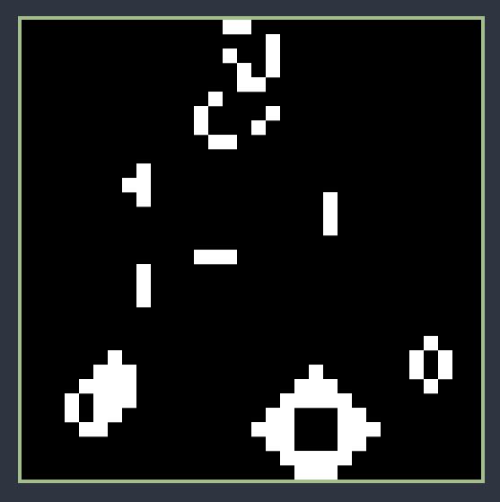

# Conway's Game of Life

*(I haven't programmed for too long. Thought it would be a good idea to get back into it by coding the Conway's Game of Life in Rust. Could have coded something else but I am not creative enough to think of any worthy project idea.)*

## Purpose

Purpose of this project was to code something in Rust already.

I chose to code Game of Life for the first time in my life while using a game engine that doesn't have a GUI. I've done neither before, valuable experience.

## Features

This is just Game of Life, nothing super interesting, but you can:

- **set window size** and **grid resolution** inside the `main.rs` file
- **pause** the game by pressing `Space`
- **speed the game up** by holding `LShift`
- **draw** live cells with `LMB`
- **unalive** live cells with `RMB` 😈
- **unalive** ALL cells by pressing `C` 😈😈😈

## todo (maybe)

- [ ] Zooming and panning
- [ ] Next step
- [ ] Current generation, live cells

## Credits

https://en.wikipedia.org/wiki/Conway's_Game_of_Life  
https://github.com/PistonDevelopers/Piston-Tutorials/  
https://github.com/PistonDevelopers/piston-examples  

